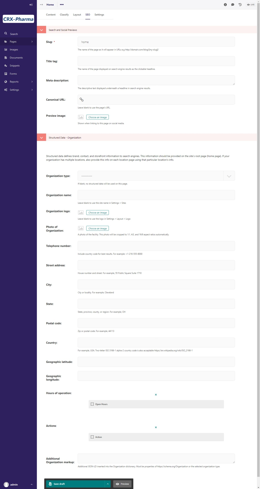

Tutorial Part 9: SEO Metadata
=============================

Wagtail CRX includes all of the technical tools you need to populate your site
with good SEO data.

Enabling SEO Metadata
---------------------

To enable or disable different types of metadata, go to **Settings > SEO**. This
will take you to the SEO settings.

    The Settings admin for SEO.

SEO settings for best practices are already selected for you, but you can change this if you would like.

Adding SEO metadata to your pages
---------------------------------

Now you will want to add SEO metadata to your pages in the CMS. This can be easily done from the page editor.
In the admin, navigate to the Home page, click the Edit option, and go to the **SEO tab**
at the top of the page editor. These are the options that you will see in the page-level SEO editor for Home page:

    The page options for SEO in the Home page.

The most important section to fill out is the **Search and Social Previews**.

* **Slug**: This is part of the URL. For example, it would be yoursite.com/home, with the "home" being the slug.

* **Title Tag**: You could just use your actual page title, but if you want something more specific or search-engine detailed, you can add one specifically for SEO.

* **Meta Description**: This is a tagline or brief description of what the page is about. It should contain the most important keyword/s.

* **Preview Image**: If people share your page on social media sites, this sets a small photo to display with the page link.

* **Structured Data**: These are a set of fields pertaining to your
  organization, such as open hours, address, organization type, etc., which
  search engines use for pulling up company information to display in search
  results or in maps. Structured Data fields should be added on the Home page,
  and also on any page representing a physical location For example, if we had
  additional branch locations, we would want to add the
  relevant structured data on each branch's page.

To save, just **Publish** the page as normal.

For information about metadata best practices, see the `SEO Starter Guide from
Google <https://support.google.com/webmasters/answer/7451184?hl=en>`_
