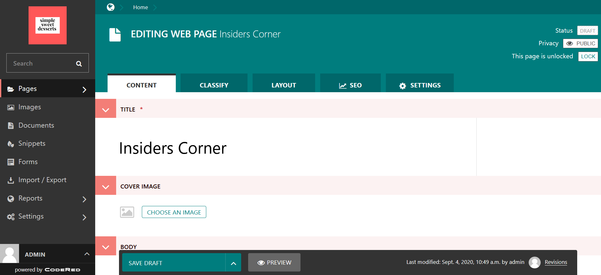
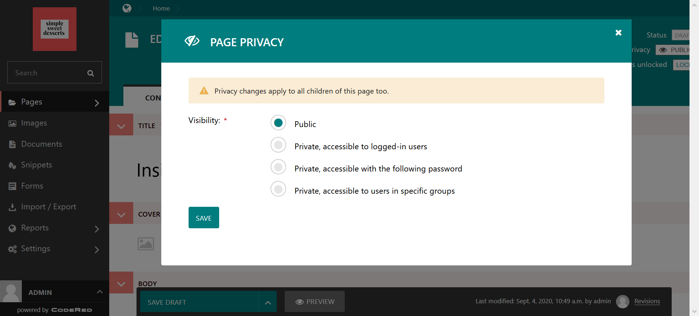

Tutorial Part 10: Password-Protected Pages
==========================================

Finally, let's talk about how to **password-protect** pages that you only want those with proper
permissions to be able to access when they visit the website. You may want to hide a document page
for special bulk pricing on custom cupcake orders or an information page for customers behind a password,
and there is an easy way to do this from within the CMS.

Navigate to the page that you want to add password-protection. You need to either save it as a draft or publish
it before you can access the Password-Protect feature.
Look up in the right-hand corner at the Privacy setting.

    Draft page with Publish options in right-hand corner.

The default setting for **Privacy** is Public, which means that the page will be available to view for anyone
who comes to the website once it has been published. You can change this by clicking on the word "Public" and revealing the pop-up that
has more Privacy options, shown below.

    The Privacy options pop-up screen.

.. note::
    Any privacy setting that you set on a parent or landing page is applied to all of the child or sub-pages as well.

Select the level of privacy that you want.

* **Private, accessible to logged-in users**: Only available to those who are logged into the CMS

* **Private, accessible with the following password**: Only available from  the frontend with a password that you set

* **Private, accessible to users in specific groups**: Only available to groups that you set in the CMS, like Moderators or Editors

For a simple way to protect content on your site from unauthorized readers, select **Private, accessible with the following password**
and choose a password. If the page doesn't contain any sensitive information, the password doesn't necessarily need to be
super-complex.

You can set up password-protected pages for sales presentations, for example, or to share private or specialized,
but not sensitive, information.
