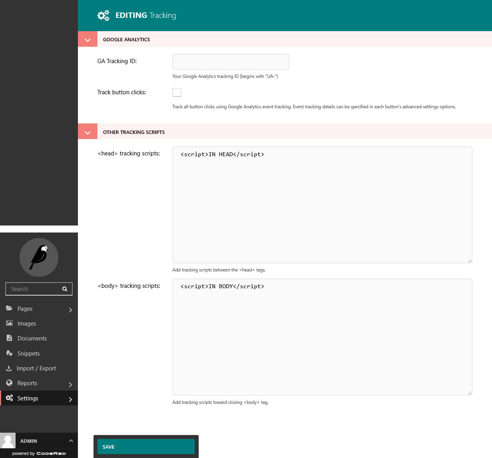

Add Tracking Scripts
====================

You can now place additional tracking scripts onto your site. Tracking scripts like
Google or Facebook Pixels can be added to the ``<head>`` and ``<body>`` of all of your web pages.
Follow these easy steps to place the codes on your site:

Google Analytics
----------------

For Google Analytics, all you need is the **GA Tracking ID**. Copy and paste this ID into the field.
Then , if you want to track button clicks, just click the checkbox. Save and you're done! 🎉✨🎊

Other Scripts
-------------

If you have other tracking codes to add, follow these steps:

#. In your Dashboard, go to **Settings > Tracking**.
#. The tracking scripts will usually give you instructions of where to place them. So, make sure to verify the instructions that were given to you.
#. Copy and paste scripts that should be between the ``<head>`` tags in the box labeled for ``<head>`` scripts.
#. Copy and paste scripts that should be toward the closing ``<body>`` tag in the box labeled for ``<body>`` scripts.
#. Click **Save** and you're done!

    The tracking dashboard.

.. note::
    You can verify that the scripts on the web page by going to the site and inspecting the Source Code.
    Then search for the ``<script>`` tags, either visually or by hitting ``CTRL + F`` on your keyboard
    and searching for the code.
    Here's how to get the Source Code if you are not sure:

    * Firefox: https://developer.mozilla.org/en-US/docs/Tools/View_source
    * Chrome: https://support.google.com/surveys/answer/6172725?hl=en
    * IE/Edge: https://docs.microsoft.com/en-us/microsoft-edge/devtools-guide-chromium/resources/

